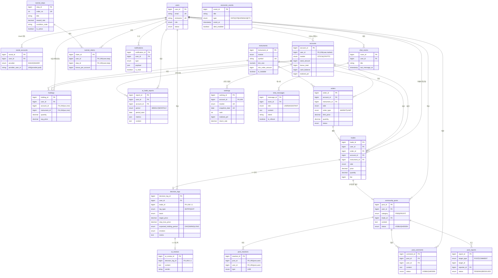

# DB 스키마 — Investory

> **Source of truth: 노션 "테이블 명세서"** ((팀 내부 Notion 문서)).
> 이 파일은 그 문서와 동기화된 사본이다. 스키마 변경은 노션에서 먼저 하고 여기로 반영한다.

주식·코인 교육형 모의투자 플랫폼 **Investory**의 백엔드 DB 스키마.

**표기 규칙**
- **Null**: `X` = NOT NULL(필수), 공란 = NULL 허용
- **Key**: PK(기본키) · FK(외래키) · UNI(유니크 제약). PK·FK·UNI는 구조·무결성 키이고, 순수 성능 인덱스는 구현 단계에서 결정한다.
- 금액은 원(KRW) `BIGINT`, 코인 수량은 `DECIMAL(24,8)`. PK는 `BIGINT` 자동증가(필요 시 UUID로 교체 가능).

## 테이블 목록

| # | 테이블명 | 물리명 | 설명 |
|---|---|---|---|
| 1 | 회원 | users | 서비스 이용자 계정 |
| 2 | 소셜 연동 | social_accounts | 카카오·네이버 OAuth 연동 정보 |
| 3 | 계좌 | accounts | 주식/코인 분리 가상 계좌 |
| 4 | 종목 | instruments | 거래 가능 종목 마스터 |
| 5 | 주문 | orders | 시장가/지정가 주문 |
| 6 | 체결 내역 | trades | 확정 체결 기록 |
| 7 | 보유 종목 | holdings | 계좌별 보유 수량·평단 |
| 8 | 투자일기 | decision_logs | 매수 계획·매도 회고 로그 |
| 9 | AI 피드백 | ai_reviews | 투자일기 대조 피드백 |
| 10 | AI 습관 리포트 | ai_habit_reports | 주간/월간 습관 분석 |
| 11 | 랭킹 | rankings | 실현손익 랭킹 (라이브 Redis + 스냅샷) |
| 12 | 튜토리얼 단계 | tutorial_steps | 입문자 온보딩 단계 정의 |
| 13 | 튜토리얼 보상 수령 | tutorial_claims | 유저별 보상 수령 이력 |
| 14 | 알림 | notifications | 체결·튜토리얼·랭킹 알림 |
| 15 | 경제 이벤트 | economic_events | 관리자 등록 이벤트 |
| 16 | 챗봇 대화방 | chat_rooms | AI 어시스턴트 세션 |
| 17 | 챗봇 메시지 | chat_messages | 대화방 내 메시지 |
| 18 | 커뮤니티 게시물 | community_posts | 게시판 글 (수익 인증 포함) |
| 19 | 게시물 댓글 | post_comments | 게시물 댓글 |
| 20 | 게시물 반응 | post_reactions | 좋아요 등 반응 |
| 21 | 게시물 신고 | post_reports | 게시물/댓글 신고 |

## ERD

---

## 1. 회원 (users)

이메일 가입과 소셜(OAuth) 가입 모두 지원. 소셜 단독 가입 시 `password_hash`는 NULL.

| 논리명 | 물리명 | 타입 | Null | Key | Default | 설명 |
|---|---|---|---|---|---|---|
| 회원ID | user_id | BIGINT | X | PK | 자동증가 | 기본 식별자 |
| 이메일 | email | VARCHAR(255) | X | UNI | - | 로그인·소셜 병합 기준 |
| 비밀번호 | password_hash | VARCHAR(255) | | | NULL | bcrypt 해시. 소셜 단독 가입 시 NULL |
| 닉네임 | nickname | VARCHAR(30) | X | UNI | - | 랭킹 표시명 |
| 역할 | role | VARCHAR(10) | X | | 'USER' | USER / ADMIN |
| 상태 | status | VARCHAR(15) | X | | 'ACTIVE' | ACTIVE / SUSPENDED |
| 가입일시 | created_at | TIMESTAMP | X | | NOW() | 계정 생성 시각 |

- 정지(SUSPENDED) 계정은 로그인·세션 복원 모두 차단.

## 2. 소셜 연동 (social_accounts)

카카오·네이버 OAuth 2.0 인가코드 연동. 한 회원이 여러 제공자를 연동 가능.

| 논리명 | 물리명 | 타입 | Null | Key | Default | 설명 |
|---|---|---|---|---|---|---|
| 연동ID | social_id | BIGINT | X | PK | 자동증가 | 기본 식별자 |
| 회원ID | user_id | BIGINT | X | FK | - | users.user_id |
| 제공자 | provider | VARCHAR(10) | X | UNI(복합) | - | KAKAO / NAVER |
| 제공자 회원ID | provider_user_id | VARCHAR(100) | X | UNI(복합) | - | OAuth 제공자 사용자 고유 ID |
| 제공자 이메일 | provider_email | VARCHAR(255) | | | NULL | 동의 시 수집. 병합 판단용 |
| 연동일시 | connected_at | TIMESTAMP | X | | NOW() | 최초 연동 시각 |

- `UNI(provider, provider_user_id)`는 같은 소셜 계정 중복 연동 차단. 동일 이메일 기존 계정은 병합.

## 3. 계좌 (accounts)

유저당 주식/코인 각 1개. 완전 분리(이체 불가). 가입 시 시드 1,000만원, 튜토리얼 보너스는 `bonus_total`에 누적.

| 논리명 | 물리명 | 타입 | Null | Key | Default | 설명 |
|---|---|---|---|---|---|---|
| 계좌ID | account_id | BIGINT | X | PK | 자동증가 | 기본 식별자 |
| 회원ID | user_id | BIGINT | X | FK, UNI(복합) | - | users.user_id |
| 시장구분 | market | VARCHAR(10) | X | UNI(복합) | - | STOCK / CRYPTO |
| 시드머니 | seed_amount | BIGINT | X | | 10000000 | 최초 지급액 (원) |
| 보너스 누적 | bonus_total | BIGINT | X | | 0 | 튜토리얼 보상 누적. 투자원금에 포함 |
| 현금 잔고 | cash_balance | BIGINT | X | | 10000000 | 주문가능 현금 (원) |
| 실현손익 누적 | realized_pnl | BIGINT | X | | 0 | 매도 확정 손익 누적 |
| 생성일시 | created_at | TIMESTAMP | X | | NOW() | 계좌 개설 시각 |

- `UNI(user_id, market)`는 "유저당 시장별 1계좌"를 DB가 강제(동시 가입 시 중복 생성 방지).
- 평가자산·미실현손익은 저장 안 함(holdings × 현재가로 계산). 수익률 = (총평가 − (seed + bonus)) / (seed + bonus).

## 4. 종목 (instruments)

거래 가능 종목 마스터. 주식 16종 + 코인 12종. 관리자가 거래 가능 여부 토글.

| 논리명 | 물리명 | 타입 | Null | Key | Default | 설명 |
|---|---|---|---|---|---|---|
| 종목ID | instrument_id | BIGINT | X | PK | 자동증가 | 기본 식별자 |
| 시장구분 | market | VARCHAR(10) | X | | - | STOCK / CRYPTO |
| 심볼 | symbol | VARCHAR(20) | X | UNI | - | 예: 005930, KRW-BTC |
| 종목명 | name | VARCHAR(50) | X | | - | 예: 삼성전자, 비트코인 |
| 호가 단위 | tick_size | DECIMAL(18,4) | X | | - | 가격대별 최소 호가 |
| 최소 주문 금액 | min_order_amount | BIGINT | X | | 0 | 코인 5,000원, 주식 0 |
| 거래 가능 | is_tradable | BOOLEAN | X | | TRUE | 관리자 토글(거래정지) |

- symbol은 종목코드(주식 6자리, 예: 005930)/마켓코드(코인, 예: KRW-BTC)와 매핑. 주식은 코스피200 등 대표 종목만 등록.

## 5. 주문 (orders)

시장가는 즉시 체결, 지정가는 PENDING으로 대기하다 현재가가 교차하면 체결. **체결 판정은 이벤트 드리븐**(공통 노트 10).

| 논리명 | 물리명 | 타입 | Null | Key | Default | 설명 |
|---|---|---|---|---|---|---|
| 주문ID | order_id | BIGINT | X | PK | 자동증가 | 기본 식별자 |
| 계좌ID | account_id | BIGINT | X | FK | - | accounts.account_id |
| 종목ID | instrument_id | BIGINT | X | FK | - | instruments.instrument_id |
| 매매구분 | side | VARCHAR(5) | X | | - | BUY / SELL |
| 주문유형 | order_type | VARCHAR(10) | X | | - | MARKET / LIMIT |
| 지정가 | limit_price | DECIMAL(18,4) | | | NULL | LIMIT일 때 필수 |
| 수량 | quantity | DECIMAL(24,8) | X | | - | 주식 정수, 코인 소수점 8자리 |
| 상태 | status | VARCHAR(10) | X | | 'PENDING' | PENDING / FILLED / CANCELLED |
| 주문일시 | created_at | TIMESTAMP | X | | NOW() | 접수 시각 |
| 체결일시 | filled_at | TIMESTAMP | | | NULL | 체결 완료 시각 |

- 매수/매도 검증은 체결 시점에 계좌 분산락으로 원자 처리. 지정가 매칭은 틱 큐 → 매칭 → 체결(공통 노트 10), 재연결 시 리컨실 백업.

## 6. 체결 내역 (trades)

확정 체결(불변 원장). Kafka 체결 이벤트 소비로 적재.

| 논리명 | 물리명 | 타입 | Null | Key | Default | 설명 |
|---|---|---|---|---|---|---|
| 체결ID | trade_id | BIGINT | X | PK | 자동증가 | 기본 식별자 |
| 회원ID | user_id | BIGINT | X | FK | - | users.user_id (소유주, 비정규화) |
| 주문ID | order_id | BIGINT | X | FK | - | orders.order_id |
| 계좌ID | account_id | BIGINT | X | FK | - | accounts.account_id |
| 종목ID | instrument_id | BIGINT | X | FK | - | instruments.instrument_id |
| 매매구분 | side | VARCHAR(5) | X | | - | BUY / SELL |
| 체결단가 | price | DECIMAL(18,4) | X | | - | 체결 가격 |
| 수량 | quantity | DECIMAL(24,8) | X | | - | 체결 수량 |
| 거래금액 | amount | BIGINT | X | | - | price × quantity (원, 반올림) |
| 수수료 | fee | BIGINT | X | | 0 | 주식 매도 거래세 포함, 코인 0.05% |
| 체결일시 | executed_at | TIMESTAMP | X | | NOW() | 체결 시각 |

- UPDATE/DELETE 금지. user_id는 내정보(주식+코인 합산) 조회를 JOIN 없이 하기 위한 안전한 비정규화(계좌 소유주 불변).

## 7. 보유 종목 (holdings)

계좌별 보유 수량·평단. 매수 시 평단 재계산, 전량 매도 시 행 삭제.

| 논리명 | 물리명 | 타입 | Null | Key | Default | 설명 |
|---|---|---|---|---|---|---|
| 보유ID | holding_id | BIGINT | X | PK | 자동증가 | 기본 식별자 |
| 회원ID | user_id | BIGINT | X | FK | - | users.user_id (비정규화) |
| 계좌ID | account_id | BIGINT | X | FK, UNI(복합) | - | accounts.account_id |
| 종목ID | instrument_id | BIGINT | X | FK, UNI(복합) | - | instruments.instrument_id |
| 보유수량 | quantity | DECIMAL(24,8) | X | | - | 현재 보유 수량 |
| 평균단가 | avg_price | DECIMAL(18,4) | X | | - | 매수 평균 단가 |
| 수정일시 | updated_at | TIMESTAMP | X | | NOW() | 마지막 변동 시각 |

- `UNI(account_id, instrument_id)`로 계좌·종목당 1행. 분산투자 판정에도 사용. 미실현손익은 조회 시 계산.

## 8. 투자일기 (decision_logs)

"기록(사람) → 피드백(AI)"의 시작점. 각 체결에 1:1로 붙어 **ENTRY(매수 계획)** / **EXIT(매도 회고)** 로 나뉜다. 매수 때는 계획값을 원탭·선택으로 가볍게, 매도 때 회고를 받는다(마찰↓·사후편향 회피).

| 논리명 | 물리명 | 타입 | Null | Key | Default | 설명 |
|---|---|---|---|---|---|---|
| 일기ID | decision_log_id | BIGINT | X | PK | 자동증가 | 기본 식별자 |
| 회원ID | user_id | BIGINT | X | FK | - | users.user_id |
| 체결ID | trade_id | BIGINT | X | FK, UNI | - | trades.trade_id (1:1, 체결 시 연결) |
| 로그유형 | log_type | VARCHAR(6) | X | | - | ENTRY(매수 계획) / EXIT(매도 회고). trade.side로 결정 |
| 판단근거 | basis | VARCHAR(50) | | | NULL | 매수 근거 NEWS/TECHNICAL/LONGTERM/GUT/ETC (ENTRY) |
| 목표가 | target_price | DECIMAL(18,4) | | | NULL | 계획한 익절 목표가 (ENTRY) |
| 손절가 | stop_loss_price | DECIMAL(18,4) | | | NULL | 계획한 손절가 (ENTRY) |
| 예상보유기간 | expected_holding_period | VARCHAR(10) | | | NULL | DAY / SWING / LONG (ENTRY) |
| 감정 | emotion | VARCHAR(10) | | | NULL | 계획대로/공포/추격/뇌동 (EXIT) |
| 메모 | memo | TEXT | | | NULL | 자유 서술 (ENTRY·EXIT 공통) |
| 작성일시 | created_at | TIMESTAMP | X | | NOW() | 기록 시각 |

- ENTRY의 계획값 ↔ EXIT의 실제·감정을 AI가 대조. 예) 예상보유=LONG인데 EXIT 단타 → "장기라며 왜 단타로 팔았나", target 80,000 → 75,000 매도 → "목표가 전에 왜 팔았나(공포?)".
- **입력 정책(팀 확정)**: 매수 시 **목표가·손절가만 필수**, 근거·예상보유기간·메모는 선택. 목표가·손절가는 그대로 가격 알림(notifications) 조건이 된다.

## 9. AI 피드백 (ai_reviews)

투자일기의 근거·계획값과 실제 시세·결과를 대조한 AI 피드백. 종목 추천 문구는 저장 전 검증 차단.

| 논리명 | 물리명 | 타입 | Null | Key | Default | 설명 |
|---|---|---|---|---|---|---|
| 피드백ID | ai_review_id | BIGINT | X | PK | 자동증가 | 기본 식별자 |
| 일기ID | decision_log_id | BIGINT | X | FK, UNI | - | decision_logs.decision_log_id (1:1) |
| 피드백 내용 | content | TEXT | X | | - | LLM 생성 서술(검증 통과분) |
| 판정 태그 | verdict | VARCHAR(20) | | | NULL | 방향적중 / 근거빗나감 / 계획이탈 |
| 생성일시 | created_at | TIMESTAMP | X | | NOW() | 생성 시각 |

- 생성 배치는 체결 N일 후. 매수/매도 권유 표현 있으면 저장 거부 후 재생성.

## 10. AI 습관 리포트 (ai_habit_reports)

거래 데이터 집계 습관 리포트. 랭킹과 달리 **미실현까지 포함**(의도적 불일치). 계좌별 산정 + 유저 단위 조회용 user_id.

| 논리명 | 물리명 | 타입 | Null | Key | Default | 설명 |
|---|---|---|---|---|---|---|
| 리포트ID | report_id | BIGINT | X | PK | 자동증가 | 기본 식별자 |
| 회원ID | user_id | BIGINT | X | FK | - | users.user_id (유저 단위 조회용) |
| 계좌ID | account_id | BIGINT | X | FK | - | accounts.account_id (분석 단위) |
| 주기 | period | VARCHAR(10) | X | | - | WEEKLY / MONTHLY |
| 기준일 | period_start | DATE | X | | - | 집계 시작일 |
| 집계 지표 | metrics | JSON | X | | - | 거래횟수·평균보유일·손절비율·종목집중 등 |
| 리포트 내용 | content | TEXT | X | | - | LLM 서술(종목 추천 금지 검증 통과분) |
| 생성일시 | created_at | TIMESTAMP | X | | NOW() | 생성 시각 |

- 집계는 서버가 계산, 서술만 LLM 위임. 투자성향 심화 분석은 그래프 DB로 확장(공통 노트 7).

## 11. 랭킹 (rankings)

**실현손익 누적 기준.** 라이브 순위는 **Redis Sorted Set(ZSET)** 으로 실시간(체결마다 갱신), 본 테이블은 주기 스냅샷 아카이브. 주식/코인 분리.

| 논리명 | 물리명 | 타입 | Null | Key | Default | 설명 |
|---|---|---|---|---|---|---|
| 랭킹ID | ranking_id | BIGINT | X | PK | 자동증가 | 기본 식별자 |
| 계좌ID | account_id | BIGINT | X | FK, UNI(복합) | - | accounts.account_id |
| 시장구분 | market | VARCHAR(10) | X | UNI(복합) | - | STOCK / CRYPTO |
| 스냅샷 일자 | snapshot_date | DATE | X | UNI(복합) | - | 집계 기준일 |
| 순위 | rank | INT | X | | - | 실현손익 내림차순 순위 |
| 실현손익 | realized_pnl | BIGINT | X | | - | 랭킹 산정 기준(실현 확정 손익 누적) |
| 수익률 | return_rate | DECIMAL(8,4) | X | | - | 참고. 자본차 보정 원하면 실현손익/투자원금으로 절충 |
| 미실현손익 | unrealized_pnl | BIGINT | X | | - | 참고 — "순위≠좋은 투자자" 대비용 |
| 거래횟수 | trade_count | INT | X | | 0 | 기간 누적 |
| 평균보유일 | avg_holding_days | DECIMAL(6,1) | X | | 0 | 기간 평균 |

- 라이브 순위·내 순위는 Redis ZSET(`ZREVRANGE`/`ZREVRANK`) O(log N). 체결마다 `ZADD rank:{market} <realized_pnl> <account_id>`. 상세는 공통 노트 9.

## 12. 튜토리얼 단계 (tutorial_steps)

완료 시 초기지급액 대비 `reward_rate`를 각 계좌에 지급.

| 논리명 | 물리명 | 타입 | Null | Key | Default | 설명 |
|---|---|---|---|---|---|---|
| 단계ID | step_id | BIGINT | X | PK | 자동증가 | 기본 식별자 |
| 순서 | order_no | INT | X | UNI | - | 표시 순서 (1~5) |
| 제목 | title | VARCHAR(50) | X | | - | 예: 첫 매수 체결하기 |
| 설명 | description | VARCHAR(200) | X | | - | 안내 문구 |
| 보상 비율 | reward_rate | DECIMAL(5,4) | X | | - | 시드 대비 (0.02 = 2%) |
| 판정 코드 | condition_code | VARCHAR(30) | X | | - | FIRST_BUY / FIRST_DIARY / DIVERSIFY_3 / FIRST_SELL / BOTH_MARKETS |
| 노출 여부 | is_active | BOOLEAN | X | | TRUE | 관리자 토글 |

- 완료 판정은 거래·일기·보유 데이터로 서버 자동 판정. **6단계 · 단계당 5%(50만원) · 총 30%(300만원/계좌)** — 가입 1,000만 → 완료 시 1,300만(기획서 예시 일치). 순서: 첫 매수 → 투자일기 작성 → 첫 매도 → 계획 대비 결과 확인 → 분산투자(2종목) → AI 리포트 열람.

## 13. 튜토리얼 보상 수령 (tutorial_claims)

유저별 수령 이력. 중복 수령 차단 + 지급액 감사.

| 논리명 | 물리명 | 타입 | Null | Key | Default | 설명 |
|---|---|---|---|---|---|---|
| 수령ID | claim_id | BIGINT | X | PK | 자동증가 | 기본 식별자 |
| 회원ID | user_id | BIGINT | X | FK, UNI(복합) | - | users.user_id |
| 단계ID | step_id | BIGINT | X | FK, UNI(복합) | - | tutorial_steps.step_id |
| 계좌당 지급액 | bonus_per_account | BIGINT | X | | - | 지급 시점 시드 × reward_rate (원) |
| 수령일시 | claimed_at | TIMESTAMP | X | | NOW() | 수령 시각 |

- `UNI(user_id, step_id)`로 단계당 1회. 수령 시 accounts.cash_balance·bonus_total을 트랜잭션 동시 갱신.

## 14. 알림 (notifications)

체결·튜토리얼·목표가·랭킹·이벤트 알림. Kafka 컨슈머 적재.

| 논리명 | 물리명 | 타입 | Null | Key | Default | 설명 |
|---|---|---|---|---|---|---|
| 알림ID | notification_id | BIGINT | X | PK | 자동증가 | 기본 식별자 |
| 회원ID | user_id | BIGINT | X | FK | - | users.user_id |
| 유형 | type | VARCHAR(20) | X | | - | FILL / ORDER_CANCEL / ORDER_EXPIRE / TARGET_PRICE / STOP_LOSS / TUTORIAL / RANK / COMMUNITY / EVENT |
| 내용 | payload | JSON | X | | - | 유형별 상세 |
| 읽음 여부 | is_read | BOOLEAN | X | | FALSE | 읽음 처리 |
| 생성일시 | created_at | TIMESTAMP | X | | NOW() | 발생 시각 |

## 15. 경제 이벤트 (economic_events)

관리자가 등록하는 경제 일정. alert_enabled면 도래 시 알림.

| 논리명 | 물리명 | 타입 | Null | Key | Default | 설명 |
|---|---|---|---|---|---|---|
| 이벤트ID | event_id | BIGINT | X | PK | 자동증가 | 기본 식별자 |
| 제목 | title | VARCHAR(100) | X | | - | 예: 한국은행 기준금리 결정 |
| 유형 | type | VARCHAR(15) | X | | - | RATE / CPI / EARNINGS / ETC |
| 일시 | event_at | TIMESTAMP | X | | - | 발생 예정 시각 |
| 설명 | description | VARCHAR(300) | | | NULL | 요약 설명 |
| 알림 여부 | alert_enabled | BOOLEAN | X | | TRUE | 관리자 토글 |

## 16. 챗봇 대화방 (chat_rooms)

AI 어시스턴트 대화 세션. 유저는 여러 방 보유. 제목은 첫 질문 요약 자동 생성.

| 논리명 | 물리명 | 타입 | Null | Key | Default | 설명 |
|---|---|---|---|---|---|---|
| 대화방ID | room_id | BIGINT | X | PK | 자동증가 | 기본 식별자 |
| 회원ID | user_id | BIGINT | | FK | NULL | users.user_id — 비로그인 허용 시 NULL |
| 제목 | title | VARCHAR(100) | X | | - | 첫 메시지 기반 자동 생성 |
| 생성일시 | created_at | TIMESTAMP | X | | NOW() | 방 생성 시각 |
| 마지막 메시지 일시 | last_message_at | TIMESTAMP | X | | NOW() | 목록 정렬 기준 |

## 17. 챗봇 메시지 (chat_messages)

대화방 내 개별 메시지. 종목 추천 거절 감사를 위해 저장.

| 논리명 | 물리명 | 타입 | Null | Key | Default | 설명 |
|---|---|---|---|---|---|---|
| 메시지ID | message_id | BIGINT | X | PK | 자동증가 | 기본 식별자 |
| 대화방ID | room_id | BIGINT | X | FK | - | chat_rooms.room_id |
| 역할 | role | VARCHAR(10) | X | | - | USER / ASSISTANT |
| 내용 | content | TEXT | X | | - | 메시지 본문 |
| 의도 분류 | intent | VARCHAR(30) | | | NULL | TRADE_HELP / DIARY / RANKING / TECHNICAL / RECOMMEND_BLOCKED / ETC |
| 추천 거절 여부 | is_refusal | BOOLEAN | X | | FALSE | 종목 추천 거절 응답 플래그 |
| 생성일시 | created_at | TIMESTAMP | X | | NOW() | 발생 시각 |

- 회원 연결은 chat_rooms.user_id로 관리. `is_refusal` 집계로 정책 준수율 모니터링.

## 18. 커뮤니티 게시물 (community_posts)

게시판형 커뮤니티 글. 자유 글과 수익 인증 글을 `category`로 구분. **수익 인증 글은 투자일기(체결) 첨부 필수** — 목표가·손절가·계획 준수 여부가 함께 공개돼 "운 vs 계획"이 드러난다. (기획서 4-8 게시판형 확정)

| 논리명 | 물리명 | 타입 | Null | Key | Default | 설명 |
|---|---|---|---|---|---|---|
| 게시물ID | post_id | BIGINT | X | PK | 자동증가 | 기본 식별자 |
| 회원ID | user_id | BIGINT | X | FK | - | 작성자 users.user_id |
| 닉네임 | nickname | VARCHAR(30) | X | | - | 표시용 비정규화(당시 닉네임 보존) |
| 분류 | category | VARCHAR(10) | X | | 'FREE' | FREE(자유) / PROFIT(수익 인증) |
| 체결ID | trade_id | BIGINT | | FK | NULL | 수익 인증 시 첨부 투자일기(trades.trade_id). PROFIT이면 필수 |
| 내용 | content | TEXT | X | | - | 본문 |
| 상태 | status | VARCHAR(10) | X | | 'VISIBLE' | VISIBLE / HIDDEN(신고 처리) |
| 생성일시 | created_at | TIMESTAMP | X | | NOW() | 작성 시각 |

- `category=PROFIT`이면 `trade_id` 필수(첨부된 투자일기의 목표가·손절가·계획 준수 여부를 상세에서 함께 노출). 종목별 게시판 분리는 이후 확장.

## 19. 게시물 댓글 (post_comments)

| 논리명 | 물리명 | 타입 | Null | Key | Default | 설명 |
|---|---|---|---|---|---|---|
| 댓글ID | comment_id | BIGINT | X | PK | 자동증가 | 기본 식별자 |
| 게시물ID | post_id | BIGINT | X | FK | - | community_posts.post_id |
| 회원ID | user_id | BIGINT | X | FK | - | 작성자 users.user_id |
| 닉네임 | nickname | VARCHAR(30) | X | | - | 표시용 비정규화 |
| 내용 | content | TEXT | X | | - | 댓글 본문 |
| 상태 | status | VARCHAR(10) | X | | 'VISIBLE' | VISIBLE / HIDDEN |
| 생성일시 | created_at | TIMESTAMP | X | | NOW() | 작성 시각 |

- 댓글 알림(notifications.type=COMMUNITY)의 트리거.

## 20. 게시물 반응 (post_reactions)

| 논리명 | 물리명 | 타입 | Null | Key | Default | 설명 |
|---|---|---|---|---|---|---|
| 반응ID | reaction_id | BIGINT | X | PK | 자동증가 | 기본 식별자 |
| 게시물ID | post_id | BIGINT | X | FK, UNI(복합) | - | community_posts.post_id |
| 회원ID | user_id | BIGINT | X | FK, UNI(복합) | - | 반응한 users.user_id |
| 반응유형 | type | VARCHAR(10) | X | | 'LIKE' | LIKE 등 |
| 생성일시 | created_at | TIMESTAMP | X | | NOW() | 반응 시각 |

- `UNI(post_id, user_id)`로 한 글에 유저당 1회 반응.

## 21. 게시물 신고 (post_reports)

| 논리명 | 물리명 | 타입 | Null | Key | Default | 설명 |
|---|---|---|---|---|---|---|
| 신고ID | report_id | BIGINT | X | PK | 자동증가 | 기본 식별자 |
| 대상유형 | target_type | VARCHAR(10) | X | | - | POST / COMMENT |
| 대상ID | target_id | BIGINT | X | | - | community_posts.post_id 또는 post_comments.comment_id |
| 신고자 | reporter_id | BIGINT | X | FK | - | users.user_id |
| 사유 | reason | VARCHAR(200) | | | NULL | 신고 사유 |
| 처리상태 | status | VARCHAR(10) | X | | 'PENDING' | PENDING / RESOLVED |
| 생성일시 | created_at | TIMESTAMP | X | | NOW() | 신고 시각 |

- 관리자 확인 후 대상 글/댓글을 HIDDEN 처리한다.

---

## 공통 설계 노트

1. **정합성**: 잔고·보유수량 변경은 계좌 단위 분산락(Redisson) + 트랜잭션으로 원자 처리. 평가금액·미실현손익은 저장하지 않고 조회 시 계산(이중 원장 방지).
2. **불변 원장**: trades는 UPDATE/DELETE 금지. 계좌 상태는 trades 재생으로 복원 가능.
3. **이벤트 흐름**: 체결 발생 → Kafka `trade.executed` 발행 → 알림/랭킹/습관집계/투자일기 컨슈머 병렬 소비.
4. **시세 저장 기준**: 실시간 현재가는 저장하지 않고 Redis에만 둔다(휘발 허용, 다음 틱으로 대체). 주식은 전 영업일 데이터를 재생하는 방식이라 재생용 시세 데이터가 필요하지만, 그 저장 형태(KRX 원천 테이블 여부 등)는 구현 단계에서 결정한다.
5. **user_id 비정규화**: trades·holdings·decision_logs·ai_habit_reports에 user_id 직접 보유. 계좌 소유주 불변이라 정합성 위험 없는 비정규화. 내정보(주식+코인 합산) 조회를 JOIN 없이.
6. **소프트 삭제 없음**: 탈퇴 시 개인정보만 마스킹, 거래 데이터는 익명 보존(정책 확정 필요).
7. **AI 투자성향 — 그래프 DB(튜터 제안)**: 투자성향은 '행동→근거→결과' 관계 구조라 벡터 DB보다 그래프 DB(Neo4j 등)가 적합. `(User)-[MADE]->(Trade)-[BASED_ON]->(Basis)`, `(Trade)-[RESULTED_IN]->(Outcome)`, `(Decision)-[PLANNED]->(목표가/손절가/예상보유)`로 성향 탐색. 관계형(원천) + 그래프 DB(분석 전용) 하이브리드 권장. 부담 시 metrics(JSON)로 시작 후 승격.
8. **AI 챗봇 vs 커뮤니티**: ① AI 어시스턴트(chat_rooms/messages)는 유저↔AI 요청-응답(개인, 종목 추천 거절 감사). ② 커뮤니티는 **게시판형**(community_posts/comments/reactions/reports) — 실시간 채팅방형은 채택하지 않는다. 수익 인증 글은 투자일기(trade) 첨부 필수로 "운 vs 계획"이 드러나게 한다.
9. **실시간 랭킹 — Redis Sorted Set**: 실현손익 기준이라 매도 체결 때만 변동 → 체결 이벤트마다 `ZADD rank:{market} <realized_pnl> <account_id>`로 부하 없는 실시간. 상위 N위 `ZREVRANGE`, 내 순위 `ZREVRANK`. 클라이언트엔 WebSocket(Redis Pub/Sub) 또는 몇 초 폴링. rankings 테이블은 일 단위 아카이브 병행, Redis는 accounts에서 재구축.
10. **지정가 매칭 — 이벤트 드리븐**: 고정 간격 배치는 간격 사이 지정가 교차를 놓친다. WebSocket 틱을 큐에 밀어 매칭 엔진이 종목 단위 순서로 빠짐없이 처리. 2계층 — 틱 큐(코인 실tick은 Redis Stream/인메모리, 유실 무방) → 매칭 → 체결(Kafka, 유실 불가). 체결은 계좌 분산락 원자·멱등, WebSocket 끊김은 재연결 시 현재가 재스캔으로 보정. 주식은 지연/재생 피드라 해상도가 피드에 묶임(이점은 코인 실tick에서 최대).
11. **미확정 항목**: 주식 시세 데이터 소스(증권사 API)와 지연시세 재배포 허용 여부는 법무 확인 후 확정.
